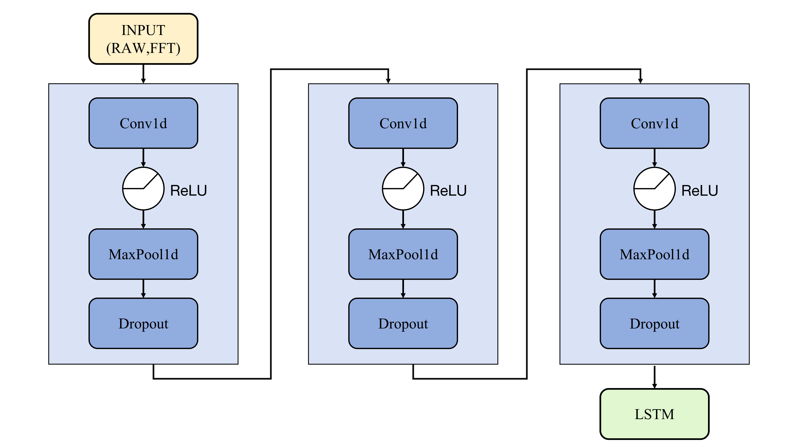
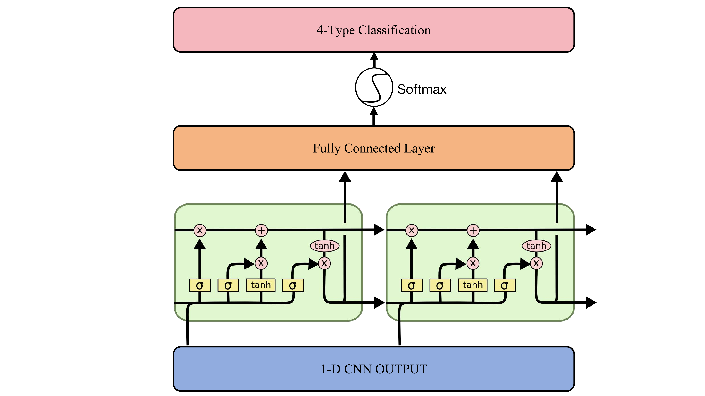
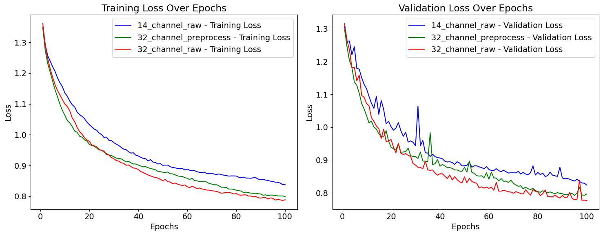
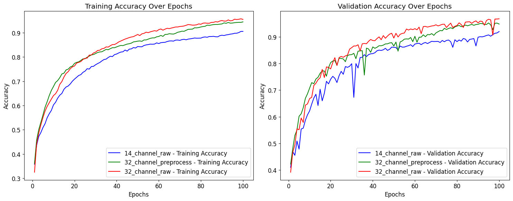

# EEG Emotion Recognition with 1D-CNN + LSTM

This project implements a hybrid deep learning model combining **1D Convolutional Neural Networks (CNNs)** and **LSTM layers** for subject-independent EEG-based emotion recognition. It is designed to process both raw EEG signals and frequency domain features (FFT), achieving high accuracy without handcrafted features.

---

## 📄 Related Paper

**Design and Optimization of a Deep Learning-Based EEG Emotion Recognition System for Subject-Independent Applications**  
[📕 View Full Thesis (PDF)](./Thesis.pdf)

---

## 📊 Data and Preprocessing

We used the **DEAP dataset** (32 participants, 40 videos per subject) and classified EEG responses based on **Valence–Arousal model** into four classes:

- HVHA (High Valence, High Arousal)
- LVHA (Low Valence, High Arousal)
- HVLA (High Valence, Low Arousal)
- LVLA (Low Valence, Low Arousal)

### 🎯 Label Distribution

### 🔎 FFT Sample (Raw Input Feature)

---

## 🧠 Model Architecture

### 🧩 Feature Extraction: 1D CNN Blocks

- 3 stacked blocks: Conv1d → ReLU → MaxPool1d → Dropout
- Extract spatial-temporal patterns from raw/FFT input

### 🔁 Temporal Learning: LSTM & Classifier

- 2-layer LSTM (256 & 128 units) captures sequential dynamics
- Fully connected + Softmax for 4-class emotion classification

---

## 📈 Results

### 📉 Loss Curves

- 32-channel raw EEG outperforms other settings

### 📈 Accuracy Curves

- Best validation accuracy: **96.73%**
- Model performs robustly even with reduced (14-channel) EEG
